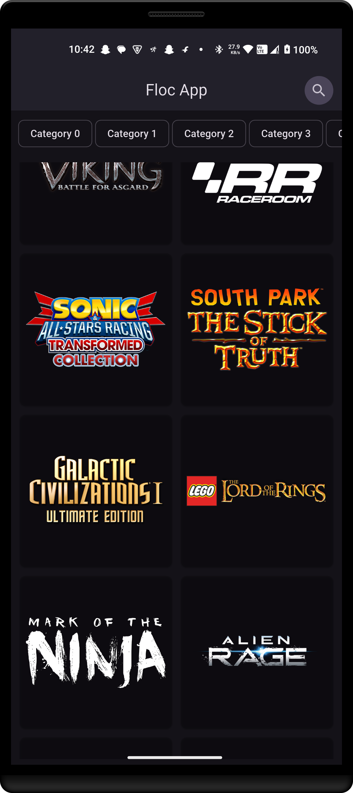
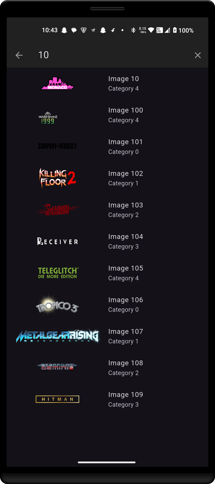
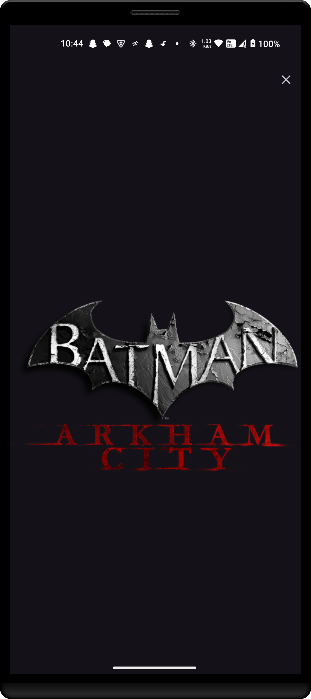

# floc app

# video link

[!https://youtube.com/shorts/j20fmwIrIRQ?feature=share](https://youtube.com/shorts/j20fmwIrIRQ?feature=share)

### screenshot 
||

A BLoC-based Flutter project.

## Getting Started

This is image app that display images from local assets. This project is built for explaining the BLoC pattern in Flutter.

### Prerequisites

- [Flutter](https://flutter.dev/docs/get-started/install)
- [Dart](https://dart.dev/get-dart)

### Installation

1. Clone the repository:
   ```sh
   git clone https://github.com/your-username/floc_app.git
   ```
2. Navigate to the project directory:
   ```sh
   cd floc_app
   ```
3. Get the dependencies:
   ```sh
   flutter pub get
   ```

### Running the App

To run the app on an emulator or physical device, use:
```sh
flutter run
```

### Project Structure

- `lib/main.dart`: Entry point of the application.
- `lib/features/presentations/pages/image_list_page.dart`: Main page displaying the list of images.
- `lib/features/presentations/widgets/category_chips.dart`: Widget for displaying category chips.
- `lib/features/presentations/widgets/image_grid.dart`: Widget for displaying images in a grid.
- `lib/features/presentations/widgets/search_bar.dart`: Widget for the search bar.
- `lib/features/presentations/blocs/image_bloc.dart`: BLoC for managing image-related state.
- `lib/data/floc_repo_impl.dart`: Implementation of the repository for fetching images.
- `lib/data/models/image_model.dart`: Model for the image data.
- `lib/data/repositories/floc_repo.dart`: Abstract repository for fetching images.
- `lib/domain/floc_repository.dart`: Interface for the repository.

build with ❤️ by zaid-kamil(www.socialmistry.com)